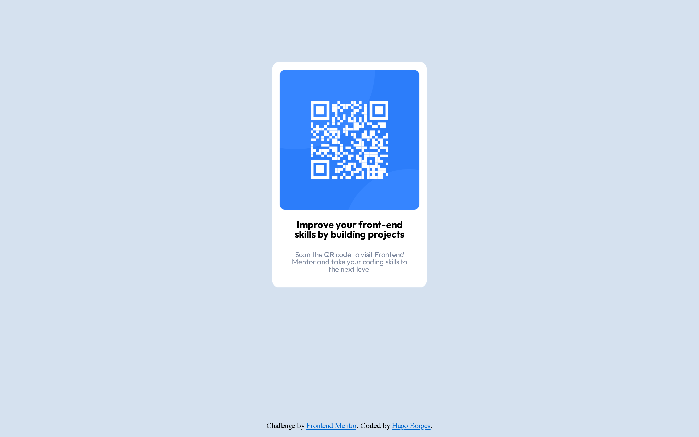

# Frontend Mentor - QR code component solution

This is a solution to the [QR code component challenge on Frontend Mentor](https://www.frontendmentor.io/challenges/qr-code-component-iux_sIO_H). Frontend Mentor challenges help you improve your coding skills by building realistic projects. 

## Table of contents

- [Overview](#overview)
  - [Screenshot](#screenshot)
  - [Links](#links)
- [My process](#my-process)
  - [Built with](#built-with)
  - [What I learned](#what-i-learned)
  - [Continued development](#continued-development)
  - [Useful resources](#useful-resources)
- [Author](#author)
- [Acknowledgments](#acknowledgments)

**Note: Delete this note and update the table of contents based on what sections you keep.**

## Overview

### Screenshot



### Links

- Solution URL: [Add solution URL here](https://your-solution-url.com)
- Live Site URL: [Add live site URL here](https://your-live-site-url.com)

## My process

### Built with

- Semantic HTML5 markup
- CSS custom properties
- Flexbox

### What I learned

Treinando a utilização do CSS

To see how you can add code snippets, see below:

```html
<!DOCTYPE html>
<html lang="pt-br">
<head>
  <meta charset="UTF-8">
  <meta name="viewport" content="width=device-width, initial-scale=1.0"> <!-- displays site properly based on user's device -->
  <link rel="icon" type="image/png" sizes="32x32" href="./images/favicon-32x32.png">
  <link href="./reset.css" rel="stylesheet">
  <link href="./style.css" rel="stylesheet">
  <title>Frontend Mentor | QR code component</title>
  <link rel="preconnect" href="https://fonts.googleapis.com">
  <link rel="preconnect" href="https://fonts.gstatic.com" crossorigin>
  <link href="https://fonts.googleapis.com/css2?family=Outfit:wght@400;700&display=swap" rel="stylesheet">
  <!-- Feel free to remove these styles or customise in your own stylesheet 👍 -->

</head>
<body>
  <section class="qrcode">
    
    <h1 class="qrcode__titulo">Improve your front-end skills by building projects</h1>
    <p class="qrcode__texto">Scan the QR code to visit Frontend Mentor and take your coding skills to the next level</p>
  </section>
  
</body>
<footer>
  <section class="attribution">
    Challenge by <a href="https://www.frontendmentor.io?ref=challenge" target="_blank">Frontend Mentor</a>. 
    Coded by <a href="#">Hugo Borges</a>.
  </section>
</footer>
  
</html>
```
```css
body {
    background-color: #D5E1EF;
    display: flex;
    align-items: center;
    flex-direction: column;
}

.qrcode {
    display: flex;
    align-items: center;
    flex-direction: column;
    border: 16px solid white;   
    border-radius: 4%;
    margin: 8rem 560px;
    background-color: white;
    padding: 0% ;
}

.qrcode__imagem {
    height: 288px;
    border-radius: 4%;
}

.qrcode__titulo {
    font-family: 'Outfit', sans-serif;
    text-align: center;
    font-size: 20px;
    padding: 5%;
    padding-top: 20px ;
    padding-bottom: 10px;
    font-weight: 700;
}

.qrcode__texto {
    text-align: center;
    font-family: 'Outfit', sans-serif;
    font-weight: 400;
    font-size: 15px;
    color: #7D889E;
    padding: 5%;
}

.attribution {
    padding-bottom: 1rem;
    text-align: center;
}

footer {
    position: fixed;
    bottom: 0;
}
```

### Continued development

Vou continuar criando sites utilizando HTML e CSS para praticar e inplementar o JS.

### Useful resources

- FrontEndMentor
- Alura Cursos

## Author

- Frontend Mentor - [@hugoborgess](https://www.frontendmentor.io/profile/HugoBorgess)


## Acknowledgments

